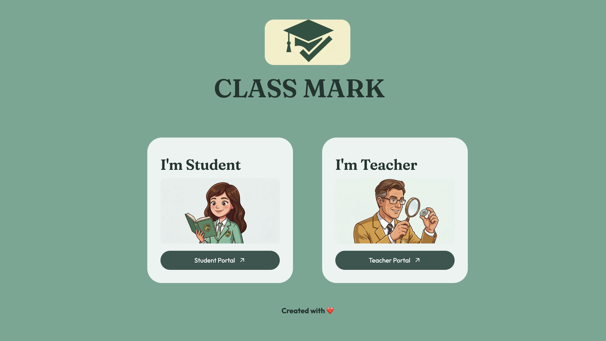

<div align="center">
# ClassMark 🎓
 
**AI powered attendance system for modern classrooms**
 
Mark attendance from a single class photo or by voice, in seconds.
 
[🚀 Live App](https://classmark-main.streamlit.app/)
 

 
</div>
## 📖 About
 
ClassMark replaces manual roll-calls with face and voice recognition. This repo contains its responsive landing page.
 
## ✨ Features
 
- 📸 **Face ID:** recognizes every student from one class photo
- 🎙️ **Voice ID:** students say "Present" and their voice is matched in real time
- 📱 **QR enrollment:** students join a course by scanning a code
- 📊 **Smart records:** confidence scores, CSV reports, and attendance trends
## ⚙️ How It Works
 
**Teacher:** log in → create a course → take attendance (photo or voice) → review records
 
**Student:** scan the course QR → view attendance percentage on a personal dashboard
 
## 🛠️ Tech Stack
 
| Layer | Tools |
| --- | --- |
| Landing page | Flask, HTML, CSS, JavaScript |
| App | Streamlit |
| Face recognition | FaceRecognition, Dlib |
| Voice recognition | Resemblyzer, Librosa |
| Database | Supabase (PostgreSQL) |
 
## 🚀 Run Locally
 
```bash
git clone <your-repo-url>
cd <your-repo-folder>
pip install flask
python app.py
```
