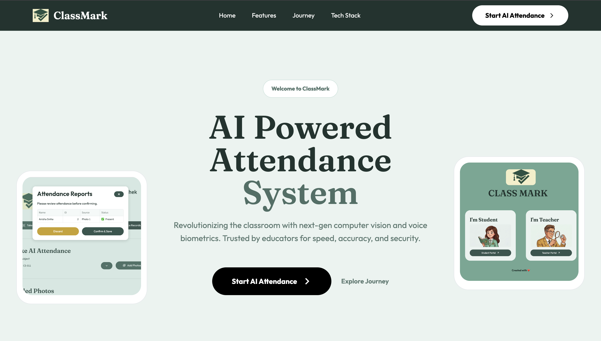

# ClassMark 🎓

**AI powered attendance system for modern classrooms**

Mark attendance from a single class photo or by voice, in seconds.

🌐 [Landing Page](https://cm-landing-page-iota.vercel.app/) · 🚀 [Live App](https://classmark-main.streamlit.app/)

| Landing Page | Streamlit App |
| --- | --- |
| |   |

## 📖 About

ClassMark replaces manual roll-calls with face and voice recognition. This repo contains its responsive landing page.

## ✨ Features

- 📸 **Face ID:** recognizes every student from one class photo
- 🎙️ **Voice ID:** students say "Present"
- 📱 **QR enrollment:** students join a course by scanning a code
- 📊 **Smart records:** CSV reports


## 🛠️ Tech Stack

| Layer | Tools |
| --- | --- |
| Landing page | Flask, HTML, CSS, JavaScript |
| App | Streamlit |
| Face recognition | FaceRecognition, Dlib |
| Voice recognition | Resemblyzer, Librosa |
| Database | Supabase (PostgreSQL) |

## 🚀 Run Locally

```bash
git clone https://github.com/AnishaSinha01/cm-landing-page
cd cm-landing-page
pip install flask
python app.py
```


## 📁 Structure

```
├── app.py
├── templates/index.html
└── static/
    ├── css/style.css
    ├── js/script.js
    └── img/
```
